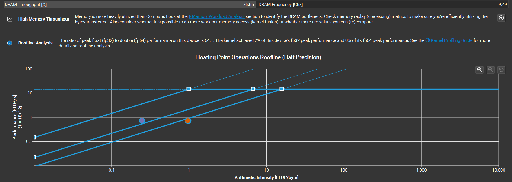
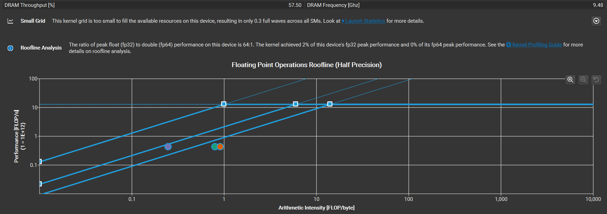
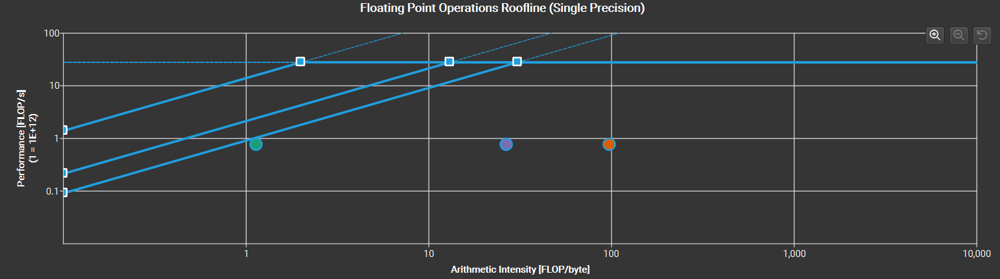
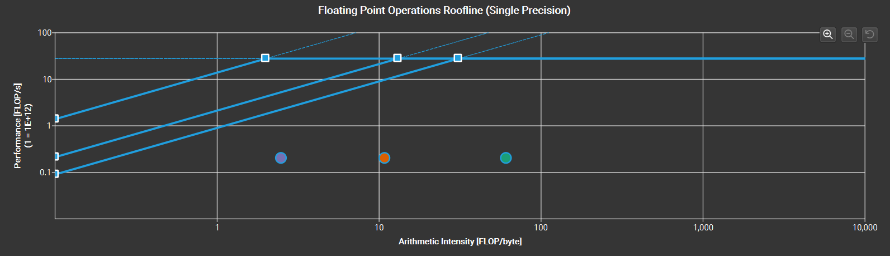
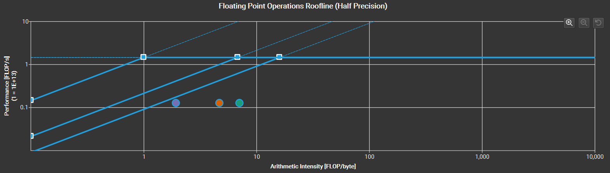

# CS 259 Miniproject 1 Report
Gabriel Castro, William Zhou, Raayan Dhar

For both kernels (classifier and conv2d), we use the same function for both sets of parameters.

## Q1. What was your basic parallelization strategy? Are there limitations in scaling this strategy, or consequences for throughput or latency?

Classifier:
===========
We're effectively implementing a GEMV kernel `y = W @ x` where `W` has shape `(Nn, Ni)` and `x` has shape `(Ni,)`.
We divide the work of the matrix-vector product by looking at each element of `y` independently:
$y_i$ is just the dot product of the $i$th row of `W` and `x`.

We have each warp be responsible for one element of `y`, and use a warp-synchronous reduce to sum the partial results within each warp.

As the amount of memory accessed per warp increases with `Ni`, as `Ni` becomes large, the memory bandwidth may become a bottleneck (thus decreasing throughput).Given that the compute required (# of iterations in the main loop executed by each warp) increases with `Ni`, latency also scales. By default, our GPU may also be underutilized since `Nn` is only `1024` in the class1 case, which means we're spawning 32 warps on a RTX 3090 with 82 SMs. 

Conv2D:
============
We take the im2col + matmul approach. We spawn a thread for each element of the input feature map and use it to populate the corresponding elements of `col_buffer` that interact with that input feature map (kernel_height x kernel_width of them). We then matmul the filter weights with `col_buffer` to get the output feature map. 

In the matmul, we tile the output matrix into 64x64 tiles (split between blocks), with each thread within each block responsible for computing an 8x8 subtile. 8x64 tiles of matrix A and 64x8 tiles of matrix B are loaded into shared memory, after which threads will compute the results for their subtile and save it in a local register. Once all threads have finished with their subtile, we write the locally stored results into the output matrix in global memory.

As the size of the im2col matrix increases, the amount of memory needing to be stored in registers in threads across different blocks also increases. Available register memory might become a bottleneck before memory bandwidth does. The im2col memory overhead can also become significant, as the buffer needs to be stored in memory and memory bandwidth requirements become large with feature map size.

We'd also like to use tensor cores for the matmul. Though we tried implementing it (see `HMMA16816`), we had correctness problems with the output (differed significantly from CUDNN).

## Q2. What is the execution time of each kernel? (and throughput if you use batching)

Classifier:
===========
```
[class1] 0.281732 ms (729.491 GFLOP/s)
[cuBLAS] 1.35234 ms (151.975 GFLOP/s)

[class2] 0.0209792 ms (399.854 GFLOP/s)
[cuBLAS] 1.56373 ms (5.36449 GFLOP/s)
```

Note that the reason we outperform cuBLAS is likely because cuBLAS does not have HGemv: https://www.cnblogs.com/thisjiang/p/12609758.html

Conv2D:
===========
```
---BENCHMARKING CONV2D LAYER1 PARAMETERS---
Conv2d_v1 TEST CHECK: True
Conv2d_v1 time: 0.4497 ms
Conv2d_v1 GFLOPS/s: 8079.6888

---BENCHMARKING CUDNN CONV2D LAYER1 PARAMETERS---
CUDNN Conv2d_v1 TEST CHECK: True
CUDNN Conv2d_v1 time (kernel only): 0.3137 ms
CUDNN Conv2d_v1 GFLOPS/s: 11582.0414

---BENCHMARKING CONV2D LAYER2 PARAMETERS---
Conv2d_v2 TEST CHECK: True
Conv2d_v2 time: 0.6596 ms
Conv2d_v2 GFLOPS/s: 1030.0903

---BENCHMARKING CUDNN CONV2D LAYER2 PARAMETERS---
CUDNN Conv2d_v2 TEST CHECK: True
CUDNN Conv2d_v2 time (kernel only): 0.3772 ms
CUDNN Conv2d_v2 GFLOPS/s: 1801.2949

---SPEEDUP COMPARISON---
Layer 1 - Mine vs CUDNN: 0.70x speedup
Layer 2 - Mine vs CUDNN: 0.57x speedup
```

## Q3. What do you suspect is the limiting factor for performance of each kernel (compute,dram,scratchpad)? Where does the implementation fall on the roofline model for your particular GPU? Please graph the results.

Classifier:
============
The limiting factor is likely memory bandwidth given that our arithmetic intensity is very low (~0.5 FLOPs/byte). This is backed up by the roofline diagram:

**Class1:**


**Class2:**


The DRAM throughput is a little lower in class2 due to lower reuse (smaller matrices).

Conv2D:
============
We have an entire additional kernel (im2col) that only contributes to memory bandwidth, so we're likely significantly bottlenecked by bandwidth.

**Conv1**:


**Conv2**:


Looking at the roofline diagrams, we see that we're heavily underperforming when it comes to both of our constraints. Let's look at the matmul kernel in particular:



This looks significantly better, which implies that the suboptimality comes from the im2col kernel. If we had more time, we could try fusing the two kernels and using tensor cores for the matmul, or use Winograd convolution to reduce the number of ops we need.

## Q4. How does the implementation compare with CUDNN? (use same batch size in CUDNN) Please graph the results.

See comparison in section 2.

## Q5. What optimizations did you find most useful/least useful?

Classifier:
===========
From most useful to least useful:
1. Warp-level programming (warp-level reduction)
2. Using #pragma unroll
3. Tuning warps per block
4. Using bit operations as opposed to arithmetic operations

Conv2D:
============
From most useful to least useful:
1. Tiling the output matrix
2. Loading shared activations into shared memory
2. Tuning threads per block