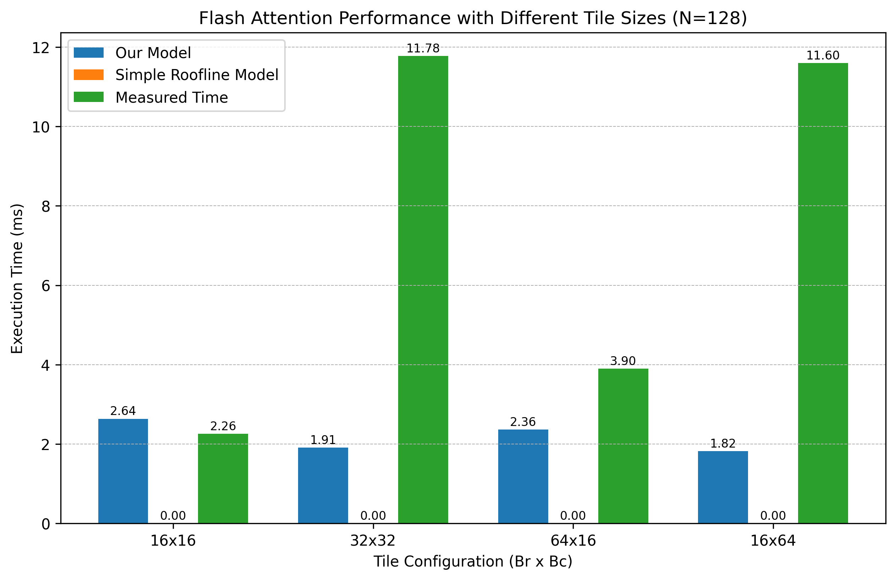
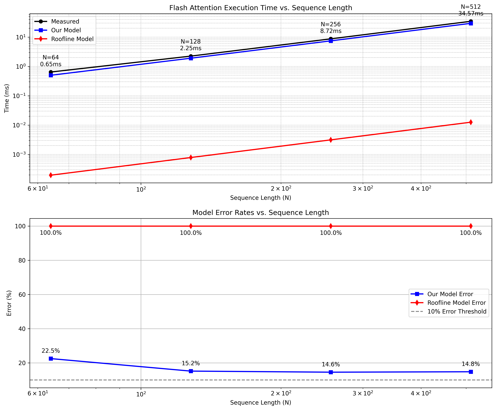

# CS 259 Miniproject 2 Report
## Flash Attention Performance Model
Gabriel Castro, William Zhou, Raayan Dhar

In this project, we write and benchmark the performance of the **flash attention kernel** - this being the kernel introduced by the first flash attention paper. Our implementation uses the paper's core optimizations:
1. Never materialize the full attention map (of shape [seq_len, seq_len]) into memory. Only use it as an intermediary to calculate tiles of the output vector.
2. Split the query matrix (shape [seq_len, Q_dim]) and key matrix (shape [seq_len, K_dim]) into tiles along the sequence length dimension, and having each thread
process one tile at a time. Think of each thread as processing the partial product of a small portion of the sequence of queries and the sequence of keys.
3. The "online softmax" trick to compute softmax on the attention map without materializing all of it.

Under standard attention, the forward pass is composed of a few operations:

$$\text{softmax}(\frac{QK^T}{\sqrt{d_k}}) V$$

Normally, we'd also have a batch dimension and an attention head dimension for $Q$ and $K$, but we've separated them between thread blocks such that each block is responsible for one instance of the above operation. 

In each thread, we compute:
$$A_{slice} = \frac{Q_{slice} K_{slice}^T}{\sqrt{d_k}}$$

Great. How do we take the softmax of this along the key sequence length dimension?

We want to calculate:
$$\text{softmax}(A_j) = \frac{e^{A_j}}{\sum_{j=0}^{N-1} e^{A_j}}$$

At each thread, we keep track of the local maximum $A_i$ and local sum of exponentials. We also keep a global maximum and global sum of exponentials, which
we update at the end of every tile. As long as we make sure to renormalize the partial sum of exponentials by the global max, we can maintain correctness.

## Modelling Performance
We're using a mechanistic model, as suggested, to try modelling the amount of FLOPS / memory transfers needed in our kernel. Our mechanistic model aims to replicate the iteration structure of the CUDA kernel to model the # of FLOPS and memory transfers for a given set of parameters (input dimensions, peak compute, memory bandwidths). While this model isn't perfect and doesn't account for memory transfer latency or model memory coalescing, it gives us a pretty good idea of the kernel's performance - and remains robust across many different input sizes, as shown in the graphs below. 

Our code can be found in the attached zip file; as an overview, here are the function signatures of our performance model:

```python
def compute_flops(B, H, N, d, Br, Bc):
    """Compute total FLOPS for flash attention"""
def compute_memory_accesses(B, H, N, d, Br, Bc):
    """Compute memory accesses (bytes) at each level of the memory hierarchy"""
def compute_operational_intensity(B, H, N, d, Br, Bc):
    """Calculate operational intensity (FLOPS/byte) at each memory level"""
def compute_execution_times(B, H, N, d, Br, Bc):
    """Calculate execution times for each potential bottleneck"""
```

With these being tunable parameters:
```python
peak_compute = 35.58 * 10**12  
dram_bandwidth = 936.2 * 10**9 
l2_bandwidth = 1500.0 * 10**9 
l1_bandwidth = 3000.0 * 10**9 
l1_size = 128 * 1024
l2_size = 6 * 1024 * 1024 
```

These constants are based on the RTX 3090's specs, save for `l1_bandwidth` and `l2_bandwidth`, which are estimates since we couldn't find the exact values.

To compute the number of operations done by each thread:

```python
    for i in range(Tr):
        for j in range(Tc):
            flops_qk += 2 * Br * Bc * d # matmul: Q_i tile (Br, d) @ K_j^T tile (Bc, d) -> Br * Bc dot products, requiring one multiply and one add per position
            flops_mij += Br * Bc # for finding maximum of attention map tile
            flops_pij += 2 * Br * Bc # for finding exponents of attention map tile
            flops_lij += Br * Bc # for computing sum of exponents
            flops_mi_new += Br # updating global max (global max = max(local max, global max))
            flops_li_new += 6 * Br # updating global sum of exponents (__expf(mi_old) - mi_new) * li_old + __expf(mij-mi_new) * lij) -> 6 flops per tile
            flops_pijv += 2 * Br * Bc * d # matmul: attention tile (Br, Bc) @ V_j^T tile (Bc, d) -> Br * Bc dot products
            flops_oi += 10 * Br * d # summing contribution of partial product in output matrix
```
Where `Br` is the query tile size and `Bc` is the key tile size. We multiply by the thread spawn values to get the total number of FLOPs for the full kernel.

We also estimate the number of DRAM, L1, and L2 accesses. Since we manage the shared memory directly, we can count its number of reads & writes for the L1 memory access values. For L2 accesses, we make the simplifying assumption that all DRAM accesses also go through L2; for a streaming kernel like FlashAttention, there's minimal data reuse across blocks, so this assumption shouldn't drop our accuracy much. For DRAM accesses, we do the following:

```python
    Tr = math.ceil(N / Br) # number of query tiles
    Tc = math.ceil(N / Bc) # number of key/value tiles
    bytes_per_element = 4 

    dram_read_qkv = 3 * (B * H * N * d * bytes_per_element) # we read Q, K, V from DRAM
    dram_read_lm = 2 * (B * H * N * bytes_per_element) # each kernel reads the global running max & running sum of exponentials
    dram_write_o = B * H * N * d * bytes_per_element # writing the output matrix (batch_size, num_heads, seq_len, d_value)
    dram_write_lm = 2 * B * H * N * bytes_per_element # each kernel writes the global running max & running exp sum
    dram_total = dram_read_qkv + dram_read_lm + dram_write_o + dram_write_lm
```

To calculate our total execution time, we use:
$$\text{compute time} = \frac{\text{flops}}{\text{peak compute}}$$
$$\text{DRAM time} = \frac{\text{dram transfers}}{\text{dram bandwidth} * \text{DRAM utilization}}$$
$$\text{L2 time} = \frac{\text{l2 transfers}}{\text{l2 bandwidth} * \text{L2 utilization}}$$
$$\text{L1 time} = \frac{\text{l1 transfers} * \text{bank conflict factor}}{\text{l1 bandwidth} * \text{L1 utilization}}$$
$$\text{time} = \max(\text{compute time}, \text{DRAM time}, \text{L2 time}, \text{L1 time})$$

We assume:
- 1% DRAM utilization
- 1% L2 utilization
- 10% L1 utilization
- 6.5 bank conflict factor for L1 cache

These are all very rough heuristic estimates, but work well empirically.

We also calculate the roofline model execution time, which assumes that the only bottlenecks are the DRAM bandwidth and GPU FLOPs (with 100% DRAM and compute utilization):
$$\text{roofline time} = \max(\frac{\text{dram transfers}}{\text{dram bandwidth}}, \frac{\text{flops}}{\text{peak compute}})$$


### Validation
We're benchmarking our code on a single RTX 3090. The set of kernel parameters we validate on are:
$$\text{batch size} = 1, \text{num heads} = 4, \text{q dim} = \text{k dim} = \text{v dim} = 32$$
$$\text{sequence length} = \{64, 128, 256, 512\}$$
$$\text{query/key tile size} = \{(16, 16), (32, 32), (64, 16), (16, 64)\}$$

Here's how our estimated performance changes with **tile size** (compared to our kernel's real performance).


Here's how our estimated performance changes with **problem size**.
In the graph below, `N` is the sequence length. Query/key tile size is fixed at `(32, 32)`.



### Analysis
We find that the bottleneck in all cases is **L1 cache** performance. As such, we can optimize our kernel by reducing bank conflicts and optimizing memory accesses (e.g by coalescing). We also ignore warp operations when we write our thread-level operations, and can gain performance there (e.g by using warp-level reduces). We also haven't experimented with loop unrolling. Given that our performance is sensitive to small perturbations in tile size, a major improvement we could make to our performance model would be to account for memory coalescing, memory latency, and the impact of locality (L2 cache). On the other hand, our model is fairly robust to changes in sequence length, which is expected given our tiling scheme.
